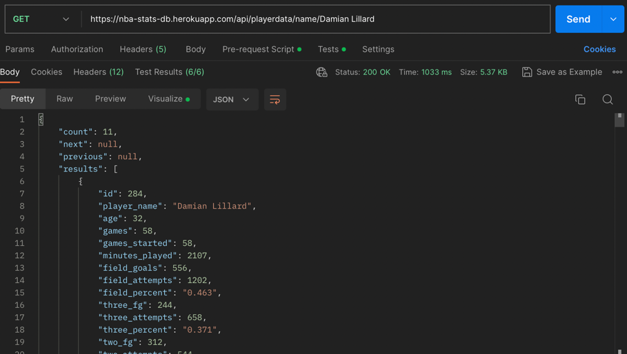
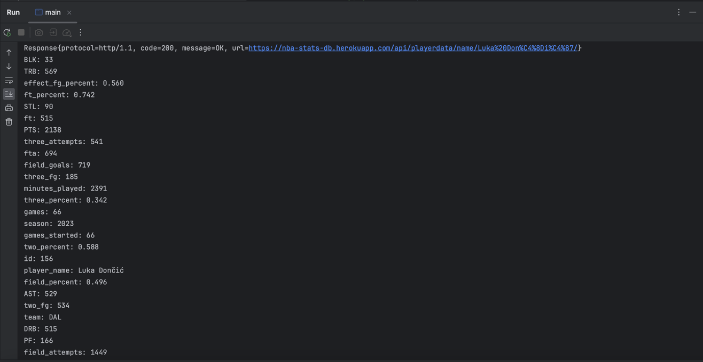

# Activity: Exploring APIs

## Problem Domain: 
NBA Fantasy Game - Draft and manage a virtual team of players from the NBA and earn points based on their real-life performances.

## Application Description:
Our team is thinking about developing a fantasy-style game which allows users to pit their favourite NBA players against one another.

In order to play NBA Fantasy, users must first create an acount or sign in. Then, they can either join a league or create their own. In each league, users must draft a team roster. After each NBA game, the players are assigned points based on their real life performances. Depending on how your team did, you either climb or fall on the leaderboard. The team with the most points at the end of the season wins.

## Link to API documentation: 

https://documenter.getpostman.com/view/24232555/2s93shzpR3?ref=apilist.fun

## Screenshots:

## Example Output:

## Technical Problems:
One problem with our current API is that it provides data from previous NBA seasons rather than game-by-game data. If we stick with this API, we would have to either simulate games based on players previous season statistics, or choose another way to assign player points. On the other hand, while an API with live game-by-game data would be ideal, we would be unable to retrieve the data right away since the NBA season does not start until October 24th.
